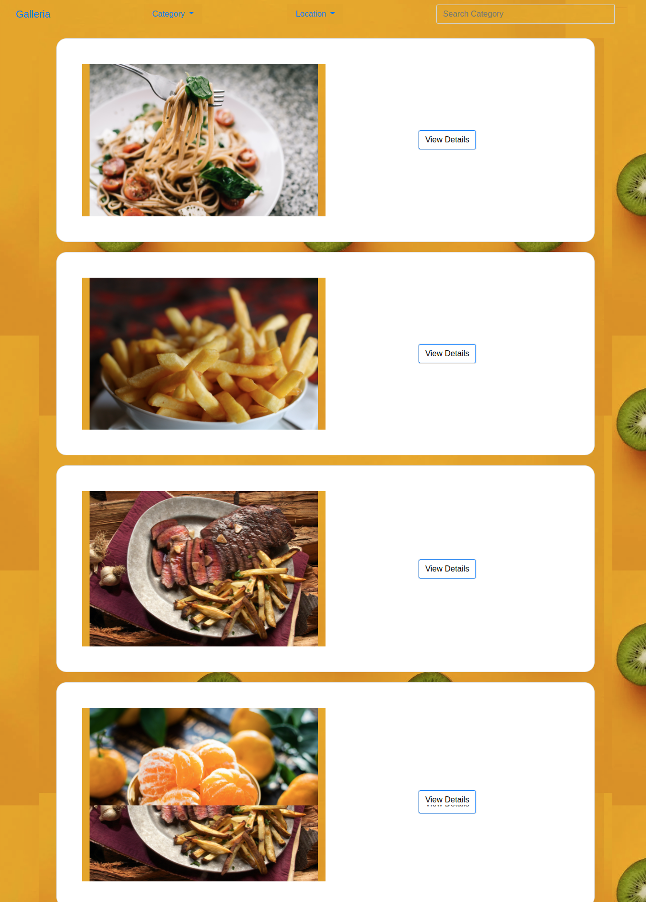

# Galleria
## Author
Maureen Gichuki

## Description
This django app allows a user to upload photos based on category and location and also filter out the view based on the two.

## User Stories

### Brief Description of the behaviours that have been implemented in the gallery application 

* View different photos that interest me.
* Click on a single photo to expand it and also view the details of the photo. The photo details must appear on a modal within the same route as the main page.
* Search for different categories of photos. (ie. Travel, Food)
* Copy a link to the photo to share with my friends.
* View photos based on the location they were taken.

## Installation
#### The application requires
* python3.8
* pip

## Cloning
* Open the terminal through {Ctrl+Alt+T}
* git clone [https://github.com/MaureenGichuki/gallery.git]

## Technologies Used
* python3.8
* Bootstrap4
* Html
* Css
* Django
* Postgres

## Contact Information
You can reach me at[maureenwaruguru@gmail.com]

## You can view the site here
Galleria []
